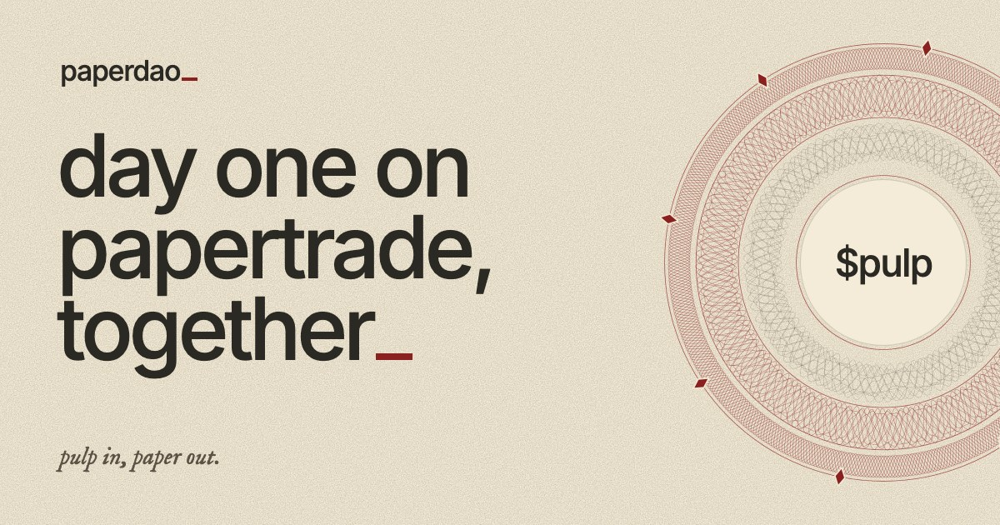
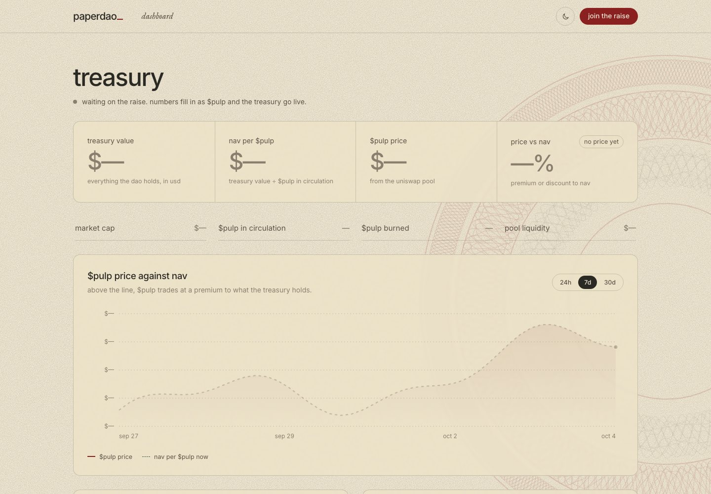
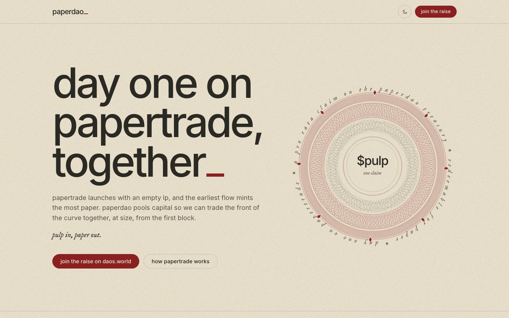

# paperdao_



**Day one on papertrade, together.**

paperdao is a community treasury that pools capital to trade [papertrade](https://papertrade.xyz) from its first block, at size, while minting PAPER is cheapest. `$PULP` is the treasury's token: a pro rata claim on everything paperdao holds, redeemable for PAPER.

[Website](https://paperdao.vercel.app) · [Dashboard](https://paperdao.vercel.app/dashboard/) · [X: @paperdao_xyz](https://x.com/paperdao_xyz)

---

## Why papertrade

papertrade is a fair-launched synthetic perpetuals exchange, fully onchain on Hyperliquid's HyperEVM.

- **No seed LP, no pre-mint, no team or VC PAPER.** The LP starts at $0.
- **The LP bootstraps from trading** (the Martingaler design). Traders trade against the pool. Winners get paid, or queued first-in, first-out if the LP is short. Losses mint PAPER, the only claim on future LP revenue.
- **You can't buy into the LP.** The only way to mint PAPER is to close a position at a loss or be liquidated.
- **Early flow gets paid.** While tracked LP is under about $2M (including while it's underwater), every $1 of loss basis mints a flat 100 PAPER. After that the curve decays, so later flow mints less by design.
- **PAPER earns USDC.** Staked PAPER receives a share of LP revenue. Once the LP clears about $5M, the excess sweeps to stakers.
- **PAPER can't be transferred at launch**, beyond staking and unstaking.

## What paperdao does

The flat mint region won't last. paperdao pools capital so holders get size on day one and share the PnL and PAPER exposure as a group, instead of watching from the sidelines.

1. **Pool.** Raise on [daos.world](https://daos.world). One treasury, with more size than any holder has alone.
2. **Trade.** Deploy a range of strategies from the first block, while minting is cheapest. The specific strategies stay private.
3. **Share.** PAPER, staking yield and PnL stay in the treasury, owned pro rata through `$PULP`.

## $PULP

`$PULP` is the daos.world token for the paperdao treasury.

| | |
|---|---|
| Total supply | 1,100,000,000 |
| Locked Uniswap v3 pool | 100,000,000 |
| What it claims | A pro rata share of the treasury: USDC trading capital, PAPER, and USDC earned from staking |
| Redemption | For PAPER, once papertrade enables transfers |

**Fees burn $PULP.** paperdao takes the full trading fee on `$PULP` volume and uses it to buy back and burn `$PULP`. The treasury stays the same while the supply shrinks, so every remaining token claims more.

```
your PAPER = treasury PAPER × your $PULP ÷ $PULP in circulation
```

## Timeline

| When | What |
|---|---|
| Before 10.08.2026 | **Raise** on daos.world (date to be announced). `$PULP` minted and the pool locked. |
| 10.08.2026 | **Predeposit.** The treasury deposits on papertrade ahead of the launch rush. |
| 10.10.2026 | **Live trading.** paperdao trades from the first block. PAPER mints from a supply of zero. |
| Later | **Redeem for PAPER.** Once PAPER can be transferred, `$PULP` holders redeem for their share. |

## Dashboard



[paperdao.vercel.app/dashboard](https://paperdao.vercel.app/dashboard/) shows:

- treasury value, NAV per `$PULP`, `$PULP` price, and price against NAV
- `$PULP` price history against NAV
- holdings by chain (Robinhood Chain, HyperEVM) or by asset
- PAPER held and papertrade's LP progress against the $2M and $5M marks
- `$PULP` supply and burns
- a lookup for what any holding is worth

Every number is read from public chain data in the visitor's browser. ETH/USD comes from Chainlink. Positions, markets and trades are never shown. The numbers fill in once the raise and the treasury go live.

## Website



[paperdao.vercel.app](https://paperdao.vercel.app)

## Links

- Website: https://paperdao.vercel.app
- Dashboard: https://paperdao.vercel.app/dashboard/
- X: https://x.com/paperdao_xyz
- papertrade: https://papertrade.xyz · [docs](https://docs.papertrade.xyz)
- daos.world: https://daos.world

## Disclaimer

paperdao is an independent community treasury. It isn't affiliated with, endorsed by or operated by papertrade or daos.world. Nothing here is financial advice or an offer of securities.

The raise is trading capital for papertrade. No returns are promised. Deposit at your own risk: `$PULP` may lose all of its value. Figures here describe papertrade's published mechanics, not expected returns.
